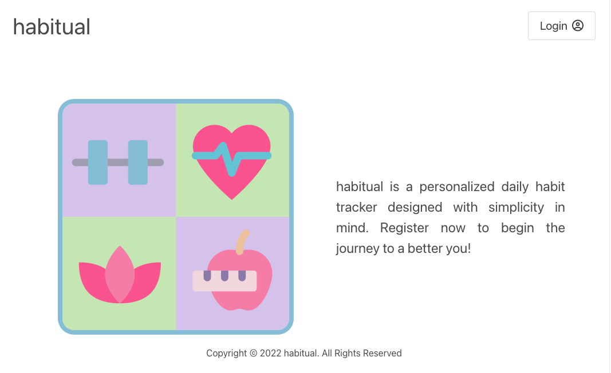
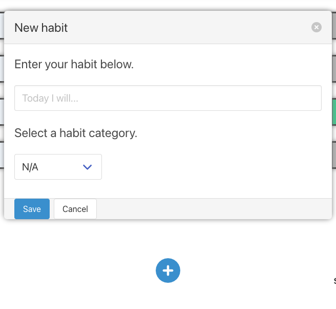
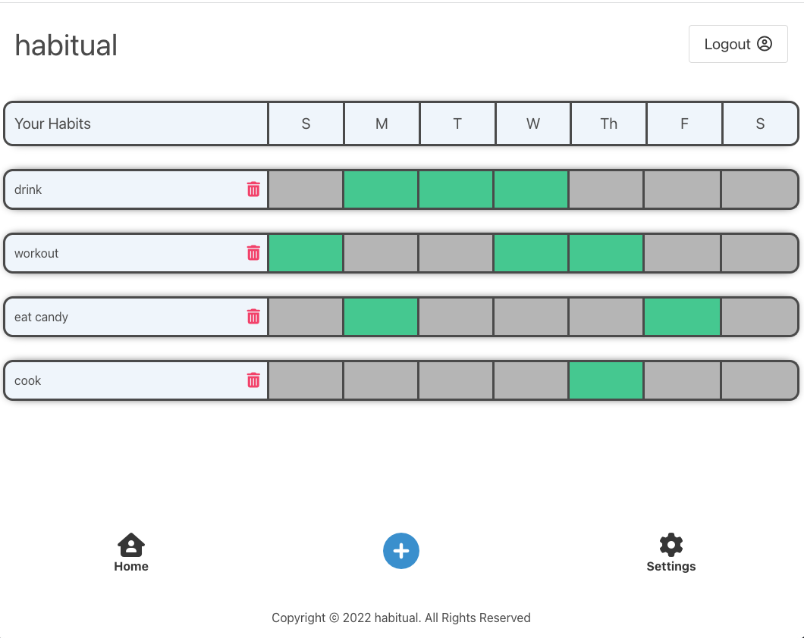

<h1 align="center"> HABITUAL</h1>  
  
<h3 align="center">:: a daily habit tracker :: </h3>

  # Description
  An app that allows users to track their daily habits in a visually simplified display to improve daily motivation, productivity, and overall mental well-being.

  
  # Table of Contents
  * [Site](#site)
  * [Installation](#installation)
  * [Usage](#usage)
  * [Questions](#questions)
  * [License](#license)
  
  # Site 
  [Project Repo](https://github.com/RJimenezTech/habit-tracker.git)

  [Project Heroku Website](https://habitualtracker.herokuapp.com/)

  ## Built With:
  Node, Express, Mysql2, Sequelize, Bcrypt, Express Handlebars, Express Session, Dotenv
  
  # Installation
  💾 
  `npm install`
  
  # Usage
  First user must clone the repo, create a `.env` file with associated passwords, sign into `mysql` account, `source db/schema.sql` from `mysql`, return to terminal to run `npm run seeds`, then `npm start` to start up server. 

   📷 
   
  
  At the homepage, user clicks `Login` and is presented a login page to resigster as a new user or log in to current account. 
  
  

  User can create a new habit by clicking the `+` button and writing in a habit and selecting the associated category.

  

  All of a user's habits will display and user can click the days in which they completed the habit and it will change to green to show the habit was completed for that day. 

  

  Clicking `logout` returns user to the homepage and the data will save upon logging back in so user can keep tracking their habits daily.

  ## Contributing
  contact us for contributions or collabs
  

  ## Questions
  Please contact us using the following links:

  :octocat: Github [Jessiferizzo](https://github.com/jessiferizzo) 

  :octocat: Github [Robert Jimenez](https://github.com/RJimenezTech)

  :octocat: Github [Rogelio P](https://github.com/realnifty)
  

  ## Acknowledgments
 MIT licensing, our great instructors and TAs, graders, and classmates

  ## License
  
  Read more about MIT here:
  [MIT](https://opensource.org/licenses/MIT)

  Copyright (c) 2022 
